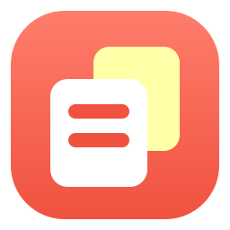

# Cherry Session Manager



**A tiny Windows tool to duplicate, delete and clean up Cherry Studio agent sessions.**
**复制、删除、清理 Cherry Studio 的会话。**

Cherry Studio can't branch a conversation. This tool can: pick a session, duplicate it, and
try another direction without touching the original. It also shows every agent and session in
a tree, with right-click actions to open the real folders on disk.

Unofficial, not affiliated with Cherry Studio. It reads and writes Cherry Studio's local
SQLite database — back it up first.

**Download:** [Releases](https://github.com/mougehongshifen/cherry-session-manager/releases) · Windows 10/11 · no Python or Bun needed

## Features

- **Duplicate / branch a session** — also restores a deleted session as a visible copy
- **Delete a session** — the dialog lists what will be removed, and Cancel is the default button
- **Clean up copies** — tick the `(副本)` sessions you want gone
- **Delete journal** — a delete keeps a small record of just the removed rows, so it can be put back later
- **Clean up old snapshots and journals**, plus an optional full snapshot before every write (off by default)
- Tree of agents / sessions: open the agent folder, the working directory, or the `.dsh` / `.claude` transcript
- Finds your data directory automatically, and asks when several installs exist

## Run

1. Download the zip from [Releases](https://github.com/mougehongshifen/cherry-session-manager/releases) and unzip it anywhere (keep the folder together)
2. Run `CherrySessionManager.exe` — the `先看这里.txt` next to it has the Chinese notes

## Build from source

```bash
pip install -r requirements.txt
python make_icon.py                                   # generate icon.ico / icon.png
python build_exe.py --bun "C:\path\to\bun.exe"        # portable folder in dist/
```

Needs Python 3.9+, PySide6 and [Bun](https://bun.sh).

## Command line

`session-tools/duplicate-session.js` works on its own:

```
--list                     --list-copies              --session <id|name> [--name X]
--delete <id|name>         --delete-many <ids>        --undo <newId>
--list-deleted             --restore-deleted <file>   --prune-deleted [--keep N]
--backup                   --list-backups             --prune-backups [--keep N]
--list-data-dir
```

Add `--data-dir <dir>` (or set `CHERRY_DATA_DIR`); destructive commands accept `--dry-run`.

## Notes

- Deleting is permanent — the delete journal is the only way back, and clearing it removes that too
- Restart Cherry Studio after deleting or restoring: it caches the session list in memory
- claude-code `.jsonl` transcripts are left alone (their runtime ids can be shared between sessions)
- Wrong data directory? Change it in Settings, or pass `--data-dir`
- `Background.png` is third-party fan art and is **not** covered by the MIT license — see [NOTICE](NOTICE)

MIT · [CHANGELOG](CHANGELOG.md) · [NOTICE](NOTICE)

---

## 中文

**复制、删除、清理 Cherry Studio 的会话 —— 一个 Windows 小工具。**

Cherry Studio 没有会话复制功能，这个工具补上：选中一个会话复制出一份新的，另起一条思路聊，
不影响原来的。另外还有删除会话、批量清理副本，以及一个「Agent → 会话」树
（右键可以打开 Agent 目录、工作目录、`.dsh` / `.claude` 记录目录）。

非官方作品，与 Cherry Studio 官方无关。它直接读写 Cherry Studio 的本地数据库，用之前建议先备份。

**用法**：从 [Releases](https://github.com/mougehongshifen/cherry-session-manager/releases)
下载 zip → 解压 → 双击 `CherrySessionManager.exe`。不用装 Python，也不用装 Bun；
文件夹里的「先看这里.txt」写得更细。

**注意**：删除是永久的（删之前会留一份很小的「留底」，可以还原，清掉留底就真没了）；
删完或还原完重启一下 Cherry Studio 才看得到；`Background.png` 是网上找的同人图，
不在 MIT 许可范围内。

MIT 许可 · [更新日志](CHANGELOG.md) · [第三方声明](NOTICE)
